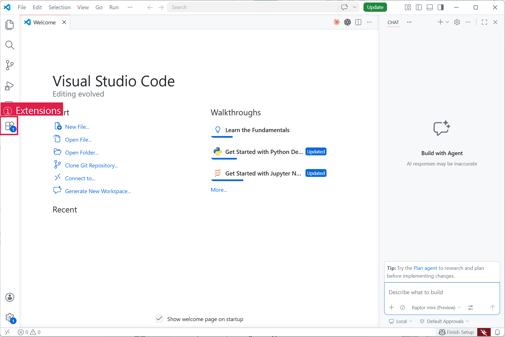
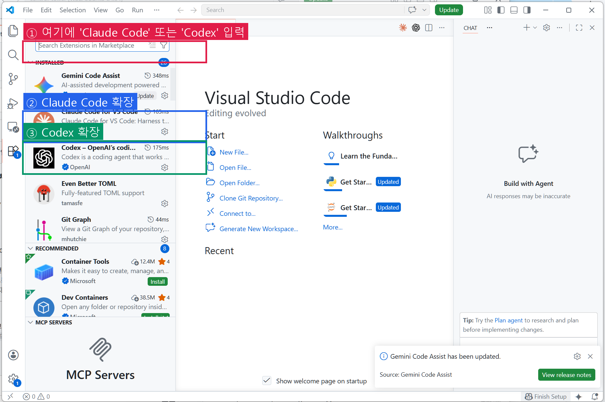
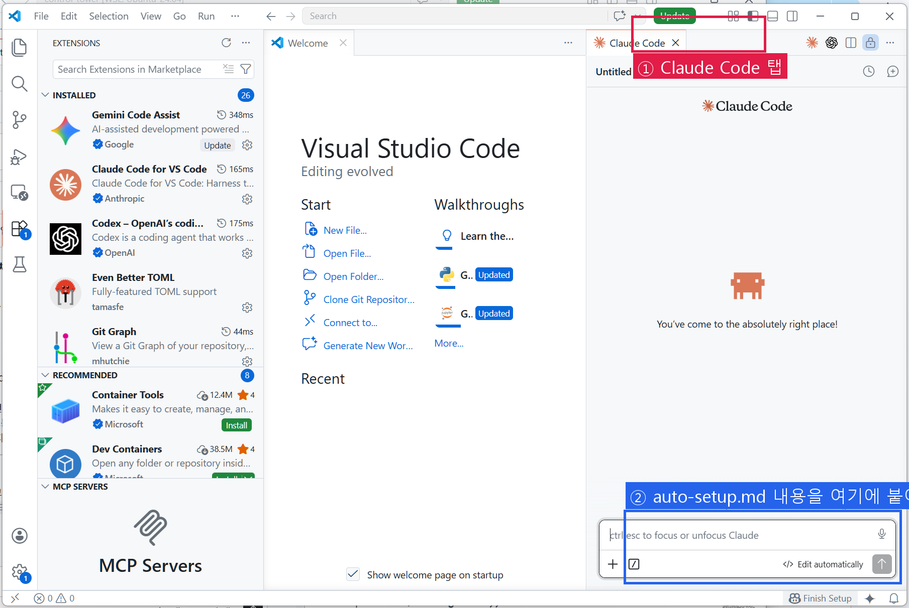

# Claude Code 세팅 가이드 (VS Code)

> Anthropic의 AI 어시스턴트. VS Code 안에서 채팅하듯 쓰는데, **내 컴퓨터 파일을 직접 읽고 고쳐줍니다.**
>
> 💰 **유료** — API 종량제 ($5부터) 또는 Max 구독 ($20/$100/$200). 이미 Claude Pro 이상 구독 중이면 추가 비용 없음.

---

> ⏱️ **예상 소요 시간**
> - 완전 처음 (VS Code·Node.js 둘 다 없음): 20~30분
> - VS Code 있음: 10~15분
>
> 😅 **막힐 때 가장 자주 보는 문서:** [troubleshooting.md](troubleshooting.md)

---

## 🗺️ 전체 흐름 — 무엇을 하는 건가요?

```
1. VS Code 설치         (에디터)
        ↓
2. Claude Code 확장 설치  (VS Code 안에 AI 붙이기)
        ↓
3. 로그인 (또는 API 키)   (요금을 누구에게 받을지 알림)
        ↓
4. AI 채팅창 열기         (오른쪽에 패널이 뜸)
        ↓
5. auto-setup.md 붙여넣기 (나머지는 AI가 자동 세팅)
```

---

## 1단계: VS Code 설치 (없으면)

이미 쓰고 있다면 **2단계로 바로 이동**.

1. https://code.visualstudio.com 접속
2. 자기 OS에 맞는 설치 파일 다운로드 → 설치
3. 실행해서 창이 뜨면 OK



---

## 2단계: Claude Code 확장 프로그램 설치

VS Code를 열고, 왼쪽 사이드바의 **확장 아이콘**(네모 4개 모양, 단축키 `Ctrl+Shift+X`) 클릭.

검색창에 `Claude Code` 입력 → Anthropic 제공 확장 → **Install** 클릭.



**또는 터미널에서 한 줄로:**

VS Code 안에서 터미널을 열어 (``Ctrl+` `` 백틱 키, 또는 상단 메뉴 → Terminal → New Terminal) 아래를 붙여넣기:

```bash
code --install-extension AnthropicAI.claude-code
```

✅ **성공 신호**: 확장 탭의 Claude Code 항목에 `Uninstall` 버튼이 보이면 설치 완료.

---

## 3단계: 인증 (둘 중 하나)

### 방법 A — Claude 구독 중 (Pro/Max)

Claude Pro ($20/월) 이상 구독 중이면 **추가 비용 없음**.

확장 설치 후 Claude Code 패널을 열면 **"Sign in"** 버튼이 나옵니다. 클릭 → 브라우저로 Claude 계정 로그인 → 완료.

### 방법 B — API 키 (종량제, 구독 없이)

구독 없이 **쓴 만큼만 과금** 받고 싶다면:

1. https://console.anthropic.com 접속 → 계정 생성
2. **Billing** 메뉴 → 크레딧 충전 (최소 $5)
   > 💡 **실감 비용**: $5면 가볍게 쓰면 **한 달 정도** 사용 가능. 많이 쓰면 며칠에 소진.
3. **API Keys** 메뉴 → "Create Key" → 복사
4. VS Code의 Claude Code 패널에서 API 키 붙여넣기

✅ **성공 신호**: 채팅창 하단에 모델 이름 (`Claude Sonnet 4.6` 등)이 뜨면 인증 완료.

---

## 4단계: 채팅창 열기

**VS Code 왼쪽 사이드바에 Claude 아이콘이 생겼습니다** (작은 별 모양).

클릭하면 오른쪽에 채팅 패널이 열림. ChatGPT 웹과 비슷한 입력창이 보임.



❓ **채팅창이 안 보이나요?**
- 상단 메뉴 → View → Command Palette (`Ctrl+Shift+P`) → `Claude Code: Open` 입력
- 그래도 안 되면 → [troubleshooting.md](troubleshooting.md)

---

## 5단계: 나머지는 Claude에게 맡기기

채팅창이 열렸으면, 아래 파일 전체 내용을 **복사해서 채팅창에 붙여넣기**:

> 📋 **[auto-setup.md](auto-setup.md)** — 이 파일을 클릭해서 열고, 내용 전체 선택(`Ctrl+A`) → 복사(`Ctrl+C`) → Claude 채팅창에 붙여넣기(`Ctrl+V`) → 엔터.

Claude가 **질문을 시작**하면 답하기만 하면 됩니다:
- "Python 프로젝트 하실 건가요?" → Yes/No
- "호칭 지정하시겠어요?" → 자유롭게 (또는 "그냥 존댓말이요")
- 등등

Claude가 알아서:
- Node.js / CLI 설치 확인 및 안내
- 플러그인 설치 (sonmat — 선택, 설명 추후)
- 글로벌 `CLAUDE.md` 생성 (호칭·기본 규칙)
- `settings.json` 생성 (허용 명령어, 훅 등)
- Python 도구 설치 (선택 시만)

✅ **성공 신호**: Claude가 마지막에 "세팅 완료! 이제 시작하세요." 라고 말하면 끝.

> 💡 **이미 Claude Code를 쓰고 있다면?**
> auto-setup.md를 붙여넣으면 "sonmat 플러그인만 추가" 옵션을 선택할 수 있음. 기존 설정을 유지하면서 병합.

---

## 참고

- **기본 모델**: Claude Sonnet 4.6 (빠르고 똑똑함)
- **모델 변경**: 채팅 중 `/model` 입력
- **컨텍스트 압축**: `/compact` (대화가 길어지면)
- **문제 해결**: [troubleshooting.md](troubleshooting.md) — 플러그인 안 보임, Windows 경로 문제 등
- **공식 문서**: https://docs.anthropic.com/en/docs/claude-code
- **주요 슬래시 명령어** (sonmat 플러그인 설치 시):
  - `/help` — 도움말
  - `/model` — 모델 변경
  - `/compact` — 컨텍스트 압축
  - `/sonmat:autoloop` — 자율 루프 (기획→실행→평가→판단)
  - `/sonmat:guard` — 커밋 전 가드레일 검증
  - `/sonmat:inspect` — 깊은 검증 모드
  - `/sonmat:imp` — 역발상 검증 (반론 제기)

---

## 📚 용어 사전 (막힐 때 돌아오기)

| 용어 | 한 줄 설명 |
|------|----------|
| **터미널** | 검은 화면에 명령어 치는 도구. VS Code 안에서 ``Ctrl+` `` 로 열림. |
| **CLI** | 터미널에서 돌아가는 프로그램. |
| **Node.js** | AI 도구가 돌아가기 위한 엔진. 한 번만 설치. |
| **npm** | Node.js의 설치 도구. `npm install ~~` 명령으로 프로그램 설치. |
| **API 키** | "내 계정 비밀번호" 같은 것. 요금 청구 주소. |
| **플러그인 (sonmat)** | AI가 성급하게 답하기 전에 "정말 맞나?" 검증하는 보조 장치. 선택. |
| **hook (훅)** | 특정 시점에 자동으로 실행되는 스크립트. "세션 시작할 때 이걸 해라" 같은 것. |
| **JSON / settings.json** | 설정 파일 양식. AI가 자동으로 만들어주므로 직접 건드릴 일 거의 없음. |
